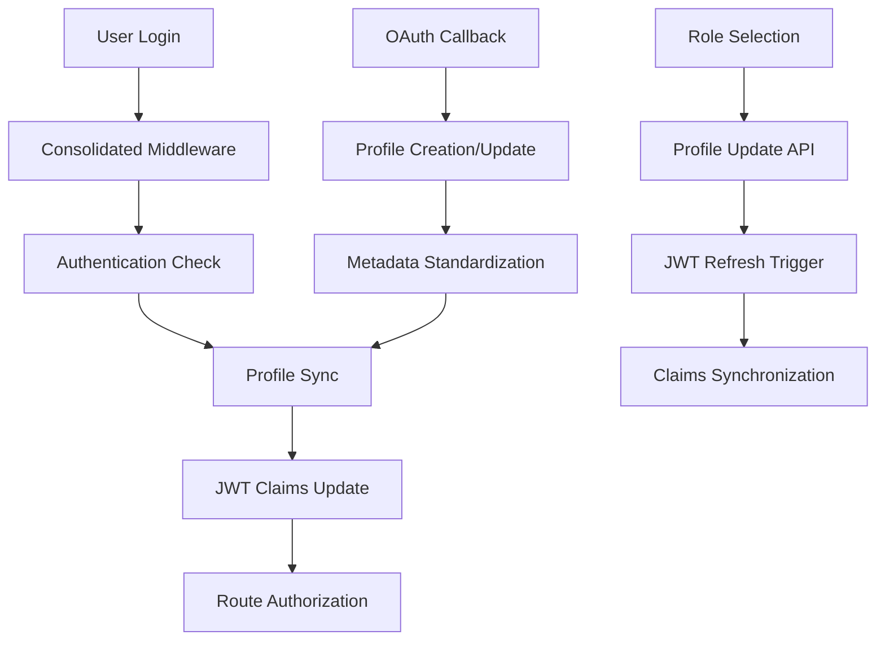

# Design Document

## Overview

This design addresses critical authentication flow issues that are preventing users from completing onboarding. The main problems identified are:

1. **Middleware Conflicts**: Two different middleware implementations causing conflicts
2. **Database Permission Errors**: Role selection failing due to missing RLS policies or incorrect table access
3. **Inconsistent User Metadata**: OAuth and manual registration creating different data structures
4. **Broken Authentication State**: JWT claims and profile data getting out of sync

The solution consolidates authentication handling, fixes database permissions, standardizes user metadata, and ensures consistent state management.

## Architecture

### Current Issues Analysis

Based on the provided code and error messages:

1. **Middleware Duplication**: There are two middleware files with different approaches:
   - `middleware.ts` (main) - Complex route-based logic
   - `utils/supabase/middleware.ts` - Simple client creation utility

2. **Database Permission Error**: The error `permission denied for table roles` suggests:
   - The `RoleSelectionModal` is trying to access a `roles` table that either doesn't exist or lacks proper RLS policies
   - The current implementation tries to query `roles` table but should use the `profiles.role` field directly
   - The consolidated auth schema may not have been applied to the database

3. **User Metadata Inconsistency**: OAuth users have different metadata structure than manual registrations

4. **JWT Claims vs Profile Mismatch**: User has `role: "mentee"` in JWT but `user_type: "mentor"` in metadata

### Proposed Architecture



## Components and Interfaces

### 1. Consolidated Middleware

**Purpose**: Single middleware handling all authentication logic

**Key Changes**:
- Remove duplicate middleware implementations (keep main `middleware.ts`, remove `utils/supabase/middleware.ts`)
- Consolidate Supabase client creation
- Implement proper cookie handling
- Add comprehensive error handling
- Fix route matching logic for dynamic routes

### 2. Profile Management API

**Purpose**: Handle role selection and profile updates with proper permissions

**Key Changes**:
- **Fix RoleSelectionModal** - Remove `roles` table dependency, update `profiles.role` directly
- **Simplify role selection** - Work with existing database structure
- **Add proper error handling** - Handle database permission errors gracefully
- **Implement JWT refresh trigger** - Update JWT claims when profile changes

### 3. Authentication Context Improvements

**Purpose**: Provide consistent authentication state management

**Key Improvements**:
- Resolve JWT claims vs profile data conflicts
- Implement automatic profile refresh on role changes
- Add proper error handling and loading states
- Ensure consistent user metadata structure

### 4. Database Schema Fixes

**Purpose**: Ensure proper permissions and table structure

**Key Changes**:
- **Work with existing structure** - Don't assume complex RBAC tables exist
- **Fix RoleSelectionModal** - Use simple profile updates instead of role table queries
- **Add basic RLS policies** - Only for tables that actually exist
- **Implement profile-based permissions** - Use profile.role field for authorization

## Data Models

### User Profile Structure (Standardized)

```typescript
interface UserProfile {
  id: string
  email: string
  first_name: string | null
  last_name: string | null
  full_name: string
  avatar_url: string | null
  bio: string | null
  location: string | null
  user_role: 'pending' | 'mentee' | 'mentor' | 'admin' | 'volunteer' | 'moderator'
  verification_status: 'pending' | 'verified' | 'rejected'
  created_at: string
  updated_at: string
}
```

### JWT Claims Structure (Standardized)

```typescript
interface JWTClaims {
  role: string
  status: string
  permissions: string[]
  user_id: string
  session_id: string
}
```

### OAuth Metadata Mapping

```typescript
interface OAuthMetadataMapping {
  google: {
    first_name: 'given_name'
    last_name: 'family_name'
    full_name: 'name'
    avatar_url: 'picture'
  }
  linkedin: {
    first_name: 'given_name'
    last_name: 'family_name'
    full_name: 'name'
    avatar_url: 'picture'
  }
  github: {
    first_name: 'name' // parsed
    last_name: 'name' // parsed
    full_name: 'name'
    avatar_url: 'avatar_url'
  }
}
```

## Error Handling

### Database Permission Errors

1. **Root Cause**: Missing RLS policies or incorrect table access
2. **Solution**: 
   - Fix RLS policies on profiles table
   - Ensure role selection uses `profiles.user_role` field
   - Add proper service role access for JWT functions

### Authentication State Conflicts

1. **Root Cause**: JWT claims and profile data out of sync
2. **Solution**:
   - Implement profile-first approach (profile data is source of truth)
   - Add JWT refresh mechanism when profile changes
   - Resolve conflicts by prioritizing profile data

### OAuth Metadata Inconsistencies

1. **Root Cause**: Different providers return different metadata structures
2. **Solution**:
   - Implement standardized metadata mapping
   - Create profile normalization function
   - Ensure consistent profile creation regardless of auth method

## Testing Strategy

### Unit Tests

1. **Middleware Tests**:
   - Route authorization logic
   - Cookie handling
   - Error scenarios

2. **API Endpoint Tests**:
   - Role selection functionality
   - Profile update operations
   - JWT refresh mechanisms

3. **Authentication Context Tests**:
   - State management
   - Profile synchronization
   - Error handling

### Integration Tests

1. **OAuth Flow Tests**:
   - Complete OAuth authentication flow
   - Profile creation and metadata mapping
   - Role selection after OAuth

2. **Role Selection Tests**:
   - End-to-end role selection process
   - JWT claims update verification
   - Redirect flow after role selection

3. **Authentication State Tests**:
   - Session persistence
   - Profile data consistency
   - Permission-based route access

### Manual Testing Scenarios

1. **OAuth Authentication**:
   - Test with Google, LinkedIn, and GitHub
   - Verify profile creation and metadata mapping
   - Test role selection flow

2. **Manual Registration**:
   - Test email/password signup
   - Verify profile structure consistency
   - Test role selection flow

3. **Edge Cases**:
   - Network failures during authentication
   - Database permission errors
   - JWT token expiration scenarios

## Implementation Priority

### Phase 1: Critical Fixes (Immediate - for launch by 28th)
1. **Fix RoleSelectionModal** - Remove dependency on `roles` table, use `profiles.role` directly
2. **Fix middleware conflicts** - Consolidate to single middleware approach
3. **Fix JWT claims synchronization** - Ensure profile changes trigger JWT refresh

### Phase 2: Database Compatibility (Next)
1. **Check existing database structure** - Work with current tables and permissions
2. **Implement profile-first approach** - Use profiles table as source of truth
3. **Add missing RLS policies** - Only for tables that actually exist

### Phase 3: User Experience (Final)
1. **Improve error handling** - Better user feedback for auth issues
2. **Standardize OAuth metadata** - Consistent profile creation
3. **Add loading states** - Better UX during auth flows

This design ensures the platform can launch by the 28th by addressing the most critical authentication issues first, then improving the overall user experience.