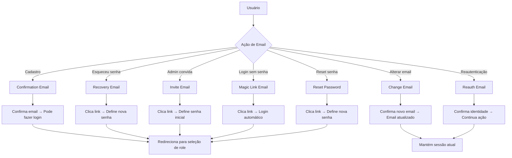
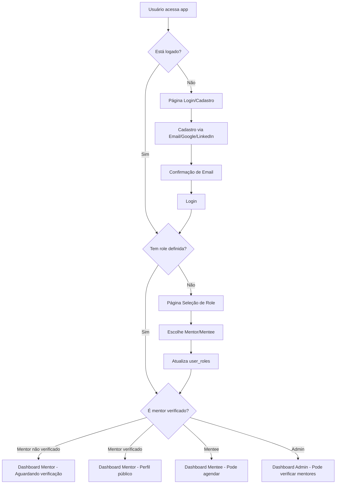

# Design Document - Auth Refactor MVP

## Overview

Esta refatoração simplifica o sistema de autenticação da plataforma de mentores, consolidando arquivos duplicados, limpando o banco de dados e implementando um fluxo MVP com funcionalidades essenciais de mentoria.

## Architecture

### Fluxo de Emails do Supabase



### Configuração de Email Templates

```toml
# supabase/config.toml
[auth.email]
enable_confirmations = true
double_confirm_changes = true
secure_email_change_enabled = true

# Templates customizados (opcional)
[auth.email.template.confirmation]
subject = "Confirme seu email - Plataforma de Mentores"
content_path = "./supabase/templates/confirmation.html"

[auth.email.template.recovery]
subject = "Recuperar senha - Plataforma de Mentores"
content_path = "./supabase/templates/recovery.html"

[auth.email.template.invite]
subject = "Você foi convidado - Plataforma de Mentores"
content_path = "./supabase/templates/invite.html"

[auth.email.template.magic_link]
subject = "Seu link de acesso - Plataforma de Mentores"
content_path = "./supabase/templates/magic_link.html"

[auth.email.template.email_change]
subject = "Confirme seu novo email - Plataforma de Mentores"
content_path = "./supabase/templates/email_change.html"
```

### Fluxo de Autenticação Simplificado



### Estrutura de Arquivos Consolidada

```
src/
├── lib/
│   ├── supabase/
│   │   ├── client.ts          # Cliente Supabase
│   │   ├── server.ts          # Server-side client
│   │   └── types.ts           # Tipos TypeScript
│   └── auth/
│       ├── auth-context.tsx   # ÚNICO context de auth
│       ├── use-auth.ts        # ÚNICO hook de auth
│       └── auth-guard.tsx     # ÚNICO guard de proteção
├── components/
│   ├── auth/
│   │   ├── login-form.tsx
│   │   ├── register-form.tsx
│   │   └── role-selection.tsx
│   └── mentors/
│       ├── mentor-list.tsx
│       ├── mentor-card.tsx
│       └── availability-form.tsx
├── pages/
│   ├── api/
│   │   ├── auth/
│   │   │   └── custom-claims.ts  # JWT custom claims (mantém ROLE_KEY)
│   │   └── mentors/
│   │       └── verify.ts         # Verificação de mentores (mantém ROLE_KEY)
│   ├── auth/
│   │   ├── login.tsx
│   │   ├── register.tsx
│   │   ├── select-role.tsx
│   │   ├── callback.tsx          # Processa todos os emails do Supabase
│   │   ├── confirm-email.tsx     # Página de confirmação pendente
│   │   ├── reset-password.tsx    # Define nova senha após recovery
│   │   └── set-password.tsx      # Define senha inicial após invite
│   ├── mentors/
│   │   ├── index.tsx            # Lista pública de mentores
│   │   └── [slug].tsx           # Página individual do mentor
│   └── dashboard/
│       ├── mentor.tsx
│       ├── mentee.tsx
│       └── admin.tsx
```

## Components and Interfaces

### Auth Context (Consolidado)

```typescript
interface AuthContextType {
  user: User | null;
  profile: Profile | null;
  role: 'mentor' | 'mentee' | 'admin' | null;
  isVerified: boolean;
  loading: boolean;
  signIn: (email: string, password: string) => Promise<void>;
  signUp: (email: string, password: string) => Promise<void>;
  signInWithProvider: (provider: 'google' | 'linkedin') => Promise<void>;
  signOut: () => Promise<void>;
  selectRole: (role: 'mentor' | 'mentee') => Promise<void>;
  refreshProfile: () => Promise<void>;
}
```

### Auth Guard (Simplificado)

```typescript
interface AuthGuardProps {
  children: React.ReactNode;
  requireRole?: boolean;
  allowedRoles?: ('mentor' | 'mentee' | 'admin')[];
  requireVerified?: boolean;
}
```

## Data Models

### Estrutura do Banco Simplificada

```sql
-- Tabela profiles (simplificada)
CREATE TABLE profiles (
  id UUID REFERENCES auth.users(id) PRIMARY KEY,
  email TEXT NOT NULL,
  first_name TEXT,
  last_name TEXT,
  full_name TEXT GENERATED ALWAYS AS (first_name || ' ' || last_name) STORED,
  avatar_url TEXT,
  slug TEXT UNIQUE,
  verified BOOLEAN DEFAULT FALSE,
  created_at TIMESTAMPTZ DEFAULT NOW(),
  updated_at TIMESTAMPTZ DEFAULT NOW()
);

-- Tabela roles (simplificada)
CREATE TABLE roles (
  id SERIAL PRIMARY KEY,
  name TEXT UNIQUE NOT NULL CHECK (name IN ('mentor', 'mentee', 'admin'))
);

-- Tabela user_roles (pode ser null inicialmente)
CREATE TABLE user_roles (
  id SERIAL PRIMARY KEY,
  user_id UUID REFERENCES profiles(id) ON DELETE CASCADE,
  role_id INTEGER REFERENCES roles(id),
  assigned_at TIMESTAMPTZ DEFAULT NOW(),
  UNIQUE(user_id, role_id)
);

-- Tabela mentor_availability (para MVP simples)
CREATE TABLE mentor_availability (
  id SERIAL PRIMARY KEY,
  mentor_id UUID REFERENCES profiles(id) ON DELETE CASCADE,
  day_of_week INTEGER CHECK (day_of_week BETWEEN 0 AND 6), -- 0=domingo
  start_time TIME NOT NULL,
  end_time TIME NOT NULL,
  created_at TIMESTAMPTZ DEFAULT NOW()
);

-- Tabela appointments (básica)
CREATE TABLE appointments (
  id SERIAL PRIMARY KEY,
  mentor_id UUID REFERENCES profiles(id),
  mentee_id UUID REFERENCES profiles(id),
  scheduled_at TIMESTAMPTZ NOT NULL,
  duration_minutes INTEGER DEFAULT 60,
  google_event_id TEXT,
  google_meet_link TEXT,
  status TEXT DEFAULT 'pending' CHECK (status IN ('pending', 'confirmed', 'cancelled')),
  created_at TIMESTAMPTZ DEFAULT NOW()
);

-- Storage bucket para avatars
INSERT INTO storage.buckets (id, name, public) VALUES ('avatars', 'avatars', true);
```

### Custom Claims Function

```sql
CREATE OR REPLACE FUNCTION auth.get_custom_claims(user_id UUID)
RETURNS JSON AS $$
DECLARE
  user_role TEXT;
  is_verified BOOLEAN;
BEGIN
  SELECT r.name, p.verified
  INTO user_role, is_verified
  FROM profiles p
  LEFT JOIN user_roles ur ON p.id = ur.user_id
  LEFT JOIN roles r ON ur.role_id = r.id
  WHERE p.id = user_id;
  
  RETURN json_build_object(
    'role', user_role,
    'verified', COALESCE(is_verified, false)
  );
END;
$$ LANGUAGE plpgsql SECURITY DEFINER;
```

## Error Handling

### Estados de Erro Principais

1. **Email não confirmado**: Redireciona para página de confirmação
2. **Role não definida**: Redireciona para seleção de role
3. **Mentor não verificado**: Dashboard com aviso de verificação pendente
4. **Acesso negado**: Página de erro com opções de navegação
5. **Token de email expirado**: Permite reenvio de email
6. **Email já confirmado**: Redireciona para login
7. **Link de recuperação inválido**: Permite nova solicitação

### Tratamento de Erros no Auth Context

```typescript
const handleAuthError = (error: AuthError) => {
  switch (error.message) {
    case 'Email not confirmed':
      router.push('/auth/confirm-email');
      break;
    case 'Invalid login credentials':
      setError('Email ou senha incorretos');
      break;
    case 'Email link is invalid or has expired':
      setError('Link expirado. Solicite um novo email.');
      break;
    case 'Email address already confirmed':
      router.push('/auth/login');
      break;
    case 'Password recovery requires email confirmation':
      setError('Confirme seu email antes de recuperar a senha');
      break;
    case 'Email change requires confirmation':
      setError('Verifique seu email para confirmar a alteração');
      break;
    default:
      setError('Erro inesperado. Tente novamente.');
  }
};
```

### Páginas de Callback para Emails

```typescript
// pages/auth/callback.tsx - Processa todos os tipos de email
export default function AuthCallback() {
  const router = useRouter();
  const { type, token_hash, next } = router.query;
  
  useEffect(() => {
    const handleEmailCallback = async () => {
      switch (type) {
        case 'signup':
          // Confirmação de cadastro
          await supabase.auth.verifyOtp({ token_hash, type: 'signup' });
          router.push('/auth/select-role');
          break;
          
        case 'recovery':
          // Recuperação de senha
          await supabase.auth.verifyOtp({ token_hash, type: 'recovery' });
          router.push('/auth/reset-password');
          break;
          
        case 'invite':
          // Convite de admin
          await supabase.auth.verifyOtp({ token_hash, type: 'invite' });
          router.push('/auth/set-password');
          break;
          
        case 'magiclink':
          // Magic link login
          await supabase.auth.verifyOtp({ token_hash, type: 'magiclink' });
          router.push('/auth/select-role');
          break;
          
        case 'email_change':
          // Confirmação de mudança de email
          await supabase.auth.verifyOtp({ token_hash, type: 'email_change' });
          router.push('/dashboard');
          break;
          
        default:
          router.push('/auth/login');
      }
    };
    
    if (token_hash) {
      handleEmailCallback();
    }
  }, [type, token_hash, router]);
  
  return <div>Processando...</div>;
}
```

## Testing Strategy

### Testes Unitários
- Auth context hooks
- Auth guard logic
- Form validations
- API endpoints

### Testes de Integração
- Fluxo completo de cadastro
- Seleção de role
- Verificação de mentor
- Agendamento básico

### Testes E2E
- Cadastro → Confirmação → Seleção Role → Dashboard
- Login com diferentes providers
- Fluxo de verificação de mentor
- Listagem pública de mentores

## API Endpoints (Mantidos)

### Endpoints que usam ROLE_KEY (manter)

```typescript
// /api/auth/custom-claims.ts
// Atualiza custom claims no JWT
// MANTÉM: Precisa do ROLE_KEY para atualizar JWT

// /api/mentors/verify.ts  
// Verifica mentores (apenas admin)
// MANTÉM: Precisa do ROLE_KEY para validação server-side

// /api/appointments/create.ts
// Cria agendamento e evento no Google Calendar
// MANTÉM: Precisa do ROLE_KEY para Google Calendar API
```

### Endpoints para remover/simplificar

- Endpoints duplicados de auth
- Endpoints que podem usar client-side do Supabase
- Endpoints com lógica complexa desnecessária

## Google Calendar Integration

### Fluxo Simplificado

1. Mentee solicita agendamento
2. Sistema verifica disponibilidade do mentor
3. Se disponível, cria registro na tabela appointments
4. API do Google Calendar cria evento com:
   - Mentor e mentee como participantes
   - Link do Google Meet automático
   - Duração padrão de 60 minutos

### Configuração Necessária

```env
GOOGLE_CALENDAR_CLIENT_ID=
GOOGLE_CALENDAR_CLIENT_SECRET=
GOOGLE_CALENDAR_REFRESH_TOKEN=
```

## Security Considerations

### Row Level Security (RLS)

```sql
-- Profiles: usuários só veem próprio perfil, exceto mentores verificados
ALTER TABLE profiles ENABLE ROW LEVEL SECURITY;

CREATE POLICY "Users can view own profile" ON profiles
  FOR SELECT USING (auth.uid() = id);

CREATE POLICY "Public can view verified mentors" ON profiles
  FOR SELECT USING (verified = true AND EXISTS (
    SELECT 1 FROM user_roles ur 
    JOIN roles r ON ur.role_id = r.id 
    WHERE ur.user_id = profiles.id AND r.name = 'mentor'
  ));

-- User_roles: usuários só veem próprias roles
CREATE POLICY "Users can view own roles" ON user_roles
  FOR SELECT USING (auth.uid() = user_id);
```

### Validações Server-side

- Verificação de email confirmado
- Validação de roles no JWT
- Proteção de endpoints administrativos
- Sanitização de dados de entrada

## Performance Optimizations

### Database Indexes

```sql
CREATE INDEX idx_profiles_slug ON profiles(slug);
CREATE INDEX idx_profiles_verified ON profiles(verified) WHERE verified = true;
CREATE INDEX idx_user_roles_user_id ON user_roles(user_id);
CREATE INDEX idx_mentor_availability_mentor_day ON mentor_availability(mentor_id, day_of_week);
```

### Caching Strategy

- Cache de perfis de mentores verificados
- Cache de disponibilidade de mentores
- Cache de custom claims no JWT

## Migration Strategy

### Fase 1: Backup e Limpeza
1. Backup completo dos dados
2. Remoção de tabelas/functions obsoletas
3. Preservação de auth.users

### Fase 2: Nova Estrutura
1. Criação das tabelas simplificadas
2. Migração de dados existentes
3. Criação de triggers e functions

### Fase 3: Refatoração do Frontend
1. Consolidação dos arquivos de auth
2. Atualização dos componentes
3. Testes de integração

### Fase 4: Deploy e Monitoramento
1. Deploy gradual
2. Monitoramento de erros
3. Rollback se necessário