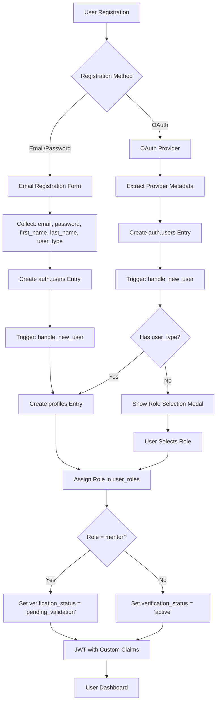

# Design Document

## Overview

This design document outlines the consolidation and cleanup of the Menvo authentication system. The current system has multiple conflicting SQL scripts and redundant frontend components that need to be unified into a single, scalable authentication flow supporting both email/password and OAuth registration with proper RBAC implementation.

## Architecture

### High-Level Authentication Flow



### Database Schema Design

#### Core Tables Structure

1. **auth.users** (Supabase managed)
   - Standard Supabase auth table
   - Contains OAuth provider data in `raw_user_meta_data`

2. **public.profiles** (Main user profile)
   - Links to auth.users via foreign key
   - Contains user display information
   - Single source of truth for user data

3. **public.roles** (RBAC roles)
   - System roles: admin, mentor, mentee, volunteer, moderator
   - Extensible for future roles

4. **public.permissions** (RBAC permissions)
   - Granular permissions for system actions
   - Mapped to roles via role_permissions

5. **public.user_roles** (User-Role assignments)
   - Links users to their roles
   - Supports multiple roles per user (future extensibility)

## Components and Interfaces

### Backend Components

#### 1. Database Functions

**handle_new_user() Trigger Function**
```sql
-- Unified function to handle both OAuth and email/password registration
-- Extracts metadata and creates profile entries
-- Assigns default roles based on user_type
```

**custom_access_token_hook() JWT Function**
```sql
-- Adds custom claims to JWT tokens
-- Includes: role, status, permissions array
-- Used by Supabase Auth for token customization
```

#### 2. Database Triggers

**on_auth_user_created Trigger**
- Fires after INSERT on auth.users
- Calls handle_new_user() function
- Creates corresponding profile entry

#### 3. Row Level Security (RLS) Policies

**Profile Access Policies**
- Users can view/edit own profiles
- Admins can view/edit all profiles
- Public read access for verified mentor profiles

### Frontend Components

#### 1. Authentication Hooks

**useAuth Hook (Consolidated)**
```typescript
interface AuthHook {
  // User state
  user: User | null
  profile: UserProfile | null
  loading: boolean
  isAuthenticated: boolean
  
  // User status checks
  needsRoleSelection: () => boolean
  needsVerification: () => boolean
  
  // Authentication operations
  signUp: (data: SignUpData) => Promise<AuthResult>
  signIn: (email: string, password: string) => Promise<AuthResult>
  signInWithGoogle: () => Promise<AuthResult>
  signInWithLinkedIn: () => Promise<AuthResult>
  signOut: () => Promise<void>
}
```

**usePermissions Hook (Simplified)**
```typescript
interface PermissionsHook {
  permissions: Permission[]
  hasPermission: (permission: Permission) => boolean
  hasRole: (role: UserRole) => boolean
  isAdmin: boolean
  isMentor: boolean
  isMentee: boolean
}
```

#### 2. Authentication Components

**AuthGuard Component**
- Handles global authentication state
- Manages authentication flow modals
- Redirects unauthenticated users

**ProtectedRoute Component**
- Route-level protection
- Permission-based access control
- Fallback UI for unauthorized access

**RoleSelectionModal Component**
- Shown to OAuth users without role
- Presents mentor/mentee options only
- Updates user profile with selected role

#### 3. Registration Components

**EmailRegistrationForm**
```typescript
interface RegistrationData {
  email: string
  password: string
  firstName: string
  lastName: string
  userType: 'mentor' | 'mentee'
}
```

**OAuthButtons**
- Google and LinkedIn OAuth initiation
- Proper redirect handling
- Error state management

## Data Models

### User Profile Model

```typescript
interface UserProfile {
  id: string // UUID from auth.users
  email: string
  first_name: string
  last_name: string
  full_name: string // computed field
  avatar_url?: string
  bio?: string
  role: 'pending' | 'mentee' | 'mentor' | 'admin' | 'volunteer' | 'moderator'
  status: 'pending' | 'active' | 'suspended' | 'rejected'
  verification_status: 'pending' | 'pending_validation' | 'active' | 'rejected'
  
  // Mentor-specific fields
  expertise_areas?: string[]
  linkedin_url?: string
  
  // Timestamps
  created_at: string
  updated_at: string
}
```

### Role and Permission Models

```typescript
interface Role {
  id: string
  name: string
  description: string
  is_system_role: boolean
}

interface Permission {
  id: string
  name: string
  description: string
  resource: string
  action: string
}

interface UserRole {
  id: string
  user_id: string
  role_id: string
  is_primary: boolean
  assigned_at: string
}
```

## Error Handling

### Database Level

1. **Constraint Violations**
   - Unique email constraints
   - Foreign key constraints
   - Enum value validations

2. **Trigger Failures**
   - Graceful handling of profile creation failures
   - Rollback mechanisms for partial data

3. **Function Errors**
   - JWT hook error handling
   - Permission check failures

### Frontend Level

1. **Authentication Errors**
   - Invalid credentials
   - OAuth provider errors
   - Network connectivity issues

2. **Registration Errors**
   - Email already exists
   - Weak password validation
   - Required field validation

3. **Permission Errors**
   - Unauthorized access attempts
   - Role assignment failures
   - Token expiration handling

## Testing Strategy

### Backend Testing

1. **Database Function Tests**
   - Unit tests for handle_new_user()
   - Unit tests for custom_access_token_hook()
   - Integration tests for trigger workflows

2. **RBAC System Tests**
   - Permission assignment verification
   - Role hierarchy validation
   - RLS policy enforcement

3. **Authentication Flow Tests**
   - OAuth registration scenarios
   - Email/password registration scenarios
   - JWT token validation

### Frontend Testing

1. **Component Tests**
   - AuthGuard behavior testing
   - ProtectedRoute access control
   - Registration form validation

2. **Hook Tests**
   - useAuth state management
   - usePermissions logic validation
   - Authentication operation testing

3. **Integration Tests**
   - End-to-end registration flows
   - Authentication state persistence
   - Permission-based UI rendering

### Performance Considerations

1. **Database Optimization**
   - Proper indexing on frequently queried fields
   - Efficient RLS policy queries
   - JWT hook performance optimization

2. **Frontend Optimization**
   - Authentication state caching
   - Lazy loading of permission checks
   - Optimistic UI updates

3. **Security Considerations**
   - SQL injection prevention
   - XSS protection in user data
   - Secure JWT token handling
   - Rate limiting on authentication endpoints

## Migration Strategy

### Phase 1: Database Cleanup
1. Backup existing data
2. Remove redundant SQL scripts
3. Create unified schema script
4. Migrate existing user data

### Phase 2: Backend Consolidation
1. Implement unified trigger functions
2. Set up JWT custom claims hook
3. Configure RLS policies
4. Test authentication flows

### Phase 3: Frontend Refactoring
1. Consolidate authentication hooks
2. Unify authentication components
3. Implement role selection flow
4. Update route protection logic

### Phase 4: Testing and Validation
1. Comprehensive testing of all flows
2. Performance optimization
3. Security audit
4. Documentation updates