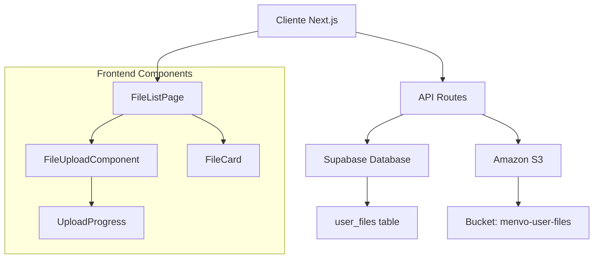
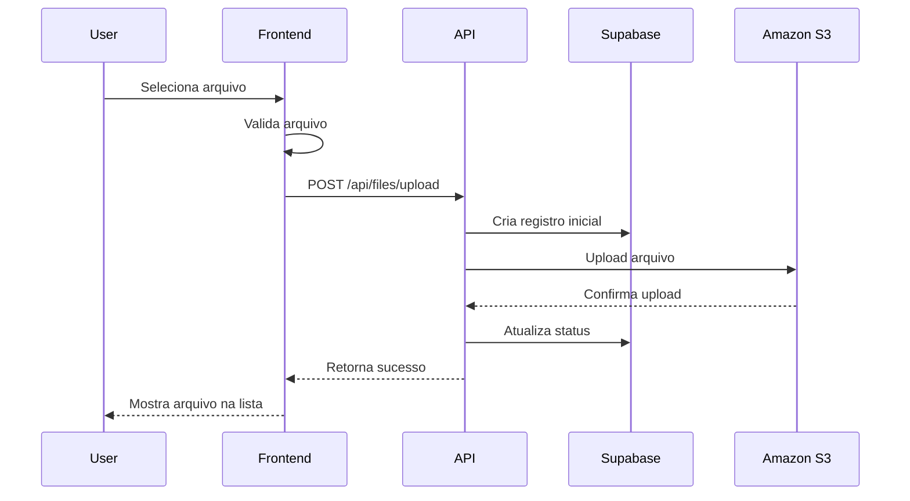
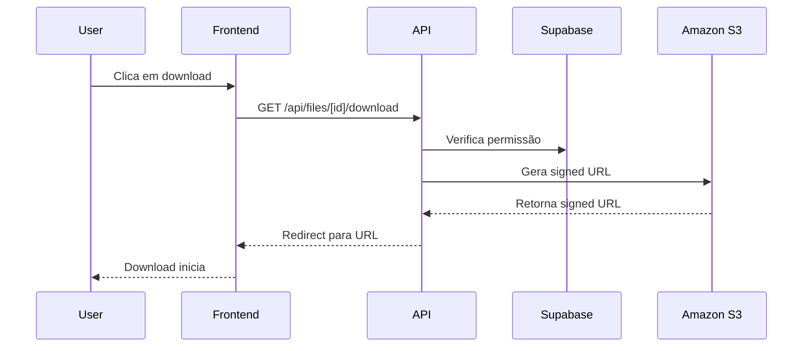

# Design Document

## Overview

O sistema "Meus Arquivos" será implementado como uma nova funcionalidade na plataforma Menvo, permitindo que usuários façam upload, visualizem e gerenciem seus arquivos pessoais. A arquitetura seguirá os padrões já estabelecidos no projeto, utilizando Next.js 15, Supabase para metadados e Amazon S3 para armazenamento de arquivos.

## Architecture

### High-Level Architecture



### Technology Stack

- **Frontend**: Next.js 15 com React 19, TypeScript, Tailwind CSS
- **Backend**: Next.js API Routes
- **Database**: Supabase PostgreSQL
- **File Storage**: Amazon S3
- **Authentication**: Supabase Auth (já implementado)
- **UI Components**: Radix UI (já em uso no projeto)

## Components and Interfaces

### Database Schema

Nova tabela `user_files` no Supabase:

```sql
CREATE TABLE user_files (
  id UUID DEFAULT gen_random_uuid() PRIMARY KEY,
  user_id UUID NOT NULL REFERENCES auth.users(id) ON DELETE CASCADE,
  original_name TEXT NOT NULL,
  file_name TEXT NOT NULL, -- Nome único no S3
  file_size BIGINT NOT NULL,
  mime_type TEXT NOT NULL,
  s3_key TEXT NOT NULL, -- Caminho completo no S3
  s3_url TEXT, -- URL pública se aplicável
  upload_status TEXT DEFAULT 'completed' CHECK (upload_status IN ('uploading', 'completed', 'failed')),
  created_at TIMESTAMP WITH TIME ZONE DEFAULT NOW(),
  updated_at TIMESTAMP WITH TIME ZONE DEFAULT NOW()
);

-- Índices para performance
CREATE INDEX idx_user_files_user_id ON user_files(user_id);
CREATE INDEX idx_user_files_created_at ON user_files(created_at DESC);

-- RLS (Row Level Security)
ALTER TABLE user_files ENABLE ROW LEVEL SECURITY;

CREATE POLICY "Users can view own files" ON user_files
  FOR SELECT USING (auth.uid() = user_id);

CREATE POLICY "Users can insert own files" ON user_files
  FOR INSERT WITH CHECK (auth.uid() = user_id);

CREATE POLICY "Users can update own files" ON user_files
  FOR UPDATE USING (auth.uid() = user_id);

CREATE POLICY "Users can delete own files" ON user_files
  FOR DELETE USING (auth.uid() = user_id);
```

### TypeScript Interfaces

```typescript
// types/user-files.ts
export interface UserFile {
  id: string;
  user_id: string;
  original_name: string;
  file_name: string;
  file_size: number;
  mime_type: string;
  s3_key: string;
  s3_url?: string;
  upload_status: 'uploading' | 'completed' | 'failed';
  created_at: string;
  updated_at: string;
}

export interface FileUploadRequest {
  file: File;
}

export interface FileUploadResponse {
  success: boolean;
  file?: UserFile;
  error?: string;
}

export interface FileListResponse {
  files: UserFile[];
  total: number;
}
```

### API Endpoints

#### 1. Upload de Arquivo
- **Endpoint**: `POST /api/files/upload`
- **Autenticação**: Requerida
- **Payload**: FormData com arquivo
- **Response**: FileUploadResponse

#### 2. Listagem de Arquivos
- **Endpoint**: `GET /api/files`
- **Autenticação**: Requerida
- **Query Params**: `page`, `limit`, `search`
- **Response**: FileListResponse

#### 3. Download de Arquivo
- **Endpoint**: `GET /api/files/[id]/download`
- **Autenticação**: Requerida
- **Response**: Redirect para signed URL do S3

#### 4. Exclusão de Arquivo
- **Endpoint**: `DELETE /api/files/[id]`
- **Autenticação**: Requerida
- **Response**: Success/Error

### Frontend Components

#### 1. FileListPage (`app/meus-arquivos/page.tsx`)
- Página principal com listagem de arquivos
- Integração com componente de upload
- Paginação e busca
- Estados de loading e erro

#### 2. FileUploadComponent (`components/files/file-upload.tsx`)
- Drag & drop interface
- Progress bar
- Validação de arquivos
- Preview de imagens

#### 3. FileCard (`components/files/file-card.tsx`)
- Exibição individual de arquivo
- Ações: download, visualizar, excluir
- Thumbnail para imagens
- Informações do arquivo

#### 4. FilePreviewModal (`components/files/file-preview-modal.tsx`)
- Modal para visualização de arquivos
- Suporte para imagens e PDFs
- Download direto

### AWS S3 Configuration

#### Bucket Structure
```
menvo-user-files/
├── users/
│   ├── {user_id}/
│   │   ├── {timestamp}_{original_name}
│   │   └── ...
```

#### Bucket Policies
- Acesso privado por padrão
- Signed URLs para download
- CORS configurado para upload direto
- Lifecycle rules para limpeza de uploads incompletos

#### Environment Variables
```env
# AWS S3
AWS_ACCESS_KEY_ID=your_access_key
AWS_SECRET_ACCESS_KEY=your_secret_key
AWS_REGION=us-east-1
AWS_S3_BUCKET=menvo-user-files
```

## Data Models

### File Upload Flow



### File Access Flow



## Error Handling

### Client-Side Errors
- Validação de tipo de arquivo
- Validação de tamanho
- Erros de rede
- Timeouts de upload

### Server-Side Errors
- Autenticação/autorização
- Falhas no S3
- Falhas no banco de dados
- Limites de quota

### Error Messages
- Mensagens em português
- Códigos de erro específicos
- Logs detalhados para debugging

## Testing Strategy

### Unit Tests
- Validação de arquivos
- Utilitários de S3
- Componentes React

### Integration Tests
- API endpoints
- Upload completo
- Download de arquivos
- Exclusão de arquivos

### E2E Tests
- Fluxo completo de upload
- Listagem e busca
- Gerenciamento de arquivos

## Security Considerations

### Authentication & Authorization
- Verificação de sessão Supabase
- RLS no banco de dados
- Validação de propriedade de arquivo

### File Security
- Validação de tipo MIME
- Scan de malware (futuro)
- Limites de tamanho
- Rate limiting

### S3 Security
- Bucket privado
- Signed URLs com expiração
- CORS restritivo
- Encryption at rest

## Performance Considerations

### Upload Performance
- Upload direto para S3
- Progress tracking
- Resumable uploads (futuro)

### List Performance
- Paginação
- Índices no banco
- Cache de metadados

### Download Performance
- CDN (CloudFront) - futuro
- Signed URLs
- Compression

## Configuration Requirements

### AWS Setup
1. Criar bucket S3 `menvo-user-files`
2. Configurar IAM user com permissões:
   - s3:PutObject
   - s3:GetObject
   - s3:DeleteObject
   - s3:GetObjectUrl
3. Configurar CORS no bucket
4. Configurar lifecycle rules

### Supabase Setup
1. Executar migration para criar tabela `user_files`
2. Configurar RLS policies
3. Adicionar triggers para updated_at

### Environment Variables
```env
# Adicionar ao .env
AWS_ACCESS_KEY_ID=your_access_key
AWS_SECRET_ACCESS_KEY=your_secret_key
AWS_REGION=us-east-1
AWS_S3_BUCKET=menvo-user-files
```

### Dependencies
```json
{
  "@aws-sdk/client-s3": "^3.x.x",
  "@aws-sdk/s3-request-presigner": "^3.x.x",
  "mime-types": "^2.x.x"
}
```