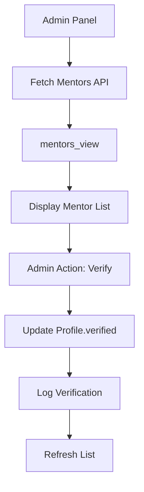

# Design Document

## Overview

Este documento descreve o design técnico para implementar a view `mentors_view`, tornar mentores visíveis publicamente e adicionar funcionalidades de validação no painel administrativo. O design foca em resolver os problemas identificados de forma simples e eficiente.

## Architecture

### Database Layer
- **mentors_view**: View SQL que agrega dados de perfis com role de mentor
- **Existing Tables**: Utiliza `profiles`, `user_roles`, `roles` existentes
- **Verification System**: Usa campo `verified` existente na tabela `profiles`

### API Layer
- **Existing APIs**: `/api/mentors` e `/api/mentors/[id]` já existem e funcionarão após criação da view
- **Admin API**: `/api/mentors/verify` já existe para verificação de mentores

### Frontend Layer
- **Public Mentor Listing**: Páginas públicas para listar mentores verificados
- **Admin Panel**: Interface administrativa para validar mentores

## Components and Interfaces

### 1. Database View - mentors_view

**Purpose**: Agregar dados de mentores de múltiplas tabelas para consumo das APIs

**Structure**:
```sql
CREATE VIEW mentors_view AS
SELECT 
  p.id,
  p.email,
  p.first_name,
  p.last_name,
  p.full_name,
  p.bio,
  p.expertise_areas,
  p.avatar_url,
  p.verified,
  p.created_at,
  p.updated_at,
  -- Campos adicionais necessários para compatibilidade com APIs
  p.expertise_areas as mentor_skills,
  p.languages,
  p.inclusive_tags as inclusion_tags,
  ARRAY['mentor'] as active_roles,
  -- Campos de localização
  p.city as location,
  p.country,
  p.state,
  -- Campos de rating (usando valores padrão por enquanto)
  COALESCE(p.average_rating, 0) as rating,
  COALESCE(p.total_reviews, 0) as reviews,
  COALESCE(p.total_sessions, 0) as sessions,
  -- Campos de disponibilidade
  p.availability_status = 'available' as is_available,
  p.timezone,
  60 as session_duration -- valor padrão
FROM profiles p
JOIN user_roles ur ON p.id = ur.user_id
JOIN roles r ON ur.role_id = r.id
WHERE r.name = 'mentor';
```

### 2. Admin Panel Components

**MentorManagementPanel**:
- Lista todos os mentores (verificados e não verificados)
- Permite verificar/desverificar mentores
- Mostra informações relevantes para validação

**MentorCard**:
- Exibe informações do mentor
- Botão de verificação/desverificação
- Status visual do mentor

### 3. Public Mentor Listing

**MentorListPage**:
- Lista apenas mentores verificados
- Filtros por expertise, localização, etc.
- Integração com APIs existentes

## Data Models

### mentors_view Fields

| Campo | Tipo | Descrição |
|-------|------|-----------|
| id | UUID | ID único do mentor |
| email | TEXT | Email do mentor |
| first_name | TEXT | Primeiro nome |
| last_name | TEXT | Último nome |
| full_name | TEXT | Nome completo (gerado) |
| bio | TEXT | Biografia do mentor |
| expertise_areas | TEXT[] | Áreas de expertise |
| mentor_skills | TEXT[] | Alias para expertise_areas |
| languages | TEXT[] | Idiomas falados |
| inclusion_tags | TEXT[] | Tags de inclusão |
| avatar_url | TEXT | URL do avatar |
| verified | BOOLEAN | Status de verificação |
| active_roles | TEXT[] | Sempre ['mentor'] |
| location | TEXT | Localização (cidade) |
| country | TEXT | País |
| state | TEXT | Estado |
| rating | NUMERIC | Rating médio |
| reviews | INTEGER | Número de reviews |
| sessions | INTEGER | Número de sessões |
| is_available | BOOLEAN | Disponibilidade |
| timezone | TEXT | Fuso horário |
| session_duration | INTEGER | Duração padrão da sessão |
| created_at | TIMESTAMPTZ | Data de criação |
| updated_at | TIMESTAMPTZ | Data de atualização |

### Admin Panel Data Flow



## Error Handling

### Database Level
- **View Creation**: Verificar se tabelas dependentes existem
- **Data Integrity**: Garantir que apenas usuários com role mentor apareçam
- **Performance**: Índices adequados nas tabelas base

### API Level
- **mentors_view Not Found**: Retornar erro claro se view não existir
- **Permission Errors**: Validar permissões de admin para verificação
- **Data Validation**: Validar dados antes de atualizar status de verificação

### Frontend Level
- **Loading States**: Mostrar loading durante operações
- **Error Messages**: Exibir mensagens claras de erro
- **Optimistic Updates**: Atualizar UI imediatamente, reverter se falhar

## Testing Strategy

### Database Testing
1. **View Creation**: Testar criação da view com dados existentes
2. **Data Accuracy**: Verificar se dados retornados estão corretos
3. **Performance**: Testar performance com volume de dados

### API Testing
1. **Mentor Listing**: Testar listagem de mentores via API
2. **Mentor Details**: Testar busca de mentor específico
3. **Admin Verification**: Testar processo de verificação

### Frontend Testing
1. **Public Listing**: Testar exibição pública de mentores
2. **Admin Panel**: Testar funcionalidades administrativas
3. **Integration**: Testar fluxo completo de verificação

### User Acceptance Testing
1. **Admin Workflow**: Admin consegue verificar mentores facilmente
2. **Public Access**: Usuários conseguem ver mentores verificados
3. **Data Consistency**: Dados mostrados são consistentes entre páginas

## Implementation Phases

### Phase 1: Database Setup
1. Criar migração para mentors_view
2. Adicionar role de mentor ao usuário admin específico
3. Testar view com dados existentes

### Phase 2: Admin Panel
1. Criar componentes de gerenciamento de mentores
2. Integrar com API de verificação existente
3. Adicionar à interface administrativa

### Phase 3: Public Listing
1. Verificar se páginas públicas funcionam com nova view
2. Testar filtros e busca
3. Ajustar layout se necessário

### Phase 4: Testing & Refinement
1. Testes de integração completos
2. Ajustes de performance
3. Documentação final