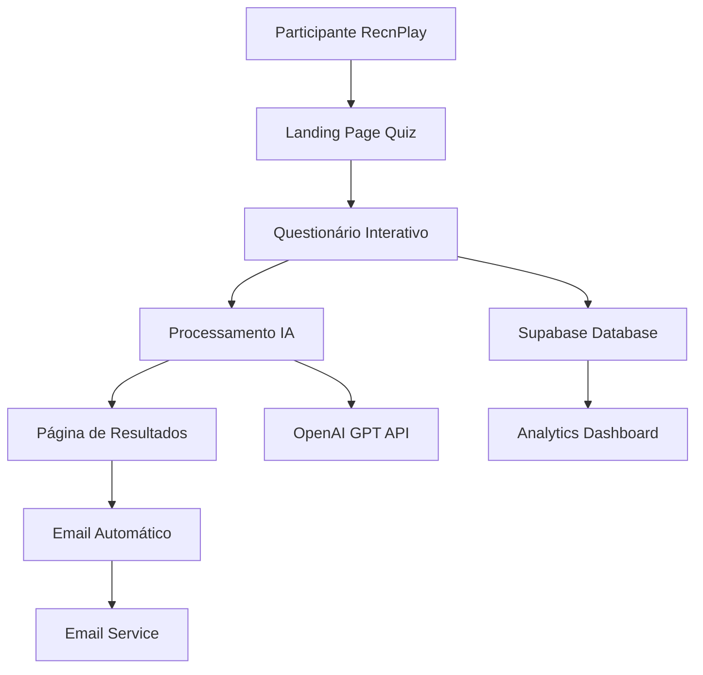

# Design Document

## Overview

O sistema de questionário inteligente do RecnPlay é projetado como uma experiência envolvente e profissional que marca positivamente os potenciais usuários da plataforma MENVO. O design foca em simplicidade, personalização e uma jornada fluida que culmina em insights valiosos gerados por IA.

## Architecture

### High-Level Architecture



### Technology Stack

- **Frontend**: Next.js 14 com TypeScript
- **Styling**: Tailwind CSS com componentes shadcn/ui
- **Database**: Supabase (PostgreSQL)
- **AI Processing**: OpenAI GPT-4 via Completions API
- **Email**: Supabase Edge Function com Resend/SendGrid
- **Analytics**: Supabase Analytics + Custom Dashboard

## Components and Interfaces

### 1. Landing Page Component (`/quiz`)

**Design Philosophy**: Primeira impressão impactante com call-to-action claro

**Visual Elements**:
- Hero section com gradiente moderno (azul/roxo)
- Ícones animados representando mentoria
- Contador de tempo estimado (2-3 minutos)
- Preview dos brindes disponíveis

**Key Features**:
- Animações sutis de entrada
- Responsive design mobile-first
- Loading states elegantes
- Micro-interações para engajamento

### 2. Quiz Form Component

**Design Philosophy**: Experiência conversacional e progressiva

**Structure**:
```typescript
interface QuizStep {
  id: number
  title: string
  type: 'multiple-choice' | 'open-text' | 'scale'
  question: string
  options?: string[]
  required: boolean
  placeholder?: string
}
```

**Visual Design**:
- Progress bar animada
- Cards com sombras suaves
- Transições fluidas entre perguntas
- Feedback visual imediato
- Botões com estados hover/active

**Questions Structure** (6 perguntas):

1. **Qual é o seu momento de carreira atual?** (Multiple Choice)
   - Estudante universitário (início do curso)
   - Estudante universitário (meio/fim do curso)
   - Recém-formado (até 1 ano)
   - Profissional júnior (1-3 anos de experiência)
   - Em transição de carreira
   - Outro

2. **Você já teve alguma experiência com mentoria?** (Multiple Choice)
   - Sim, já fui mentorado e foi muito útil
   - Sim, mas não foi uma boa experiência
   - Não, mas tenho muito interesse
   - Não, e ainda não sei se preciso
   - Já ouvi falar, mas nunca participei

3. **Quais áreas você mais gostaria de desenvolver?** (Multiple Choice - múltipla seleção)
   - Desenvolvimento técnico (hard skills)
   - Comunicação e networking
   - Liderança e gestão
   - Planejamento de carreira
   - Empreendedorismo
   - Equilíbrio vida pessoal/profissional
   - Outro: [campo aberto]

4. **Qual é o seu maior desafio profissional no momento?** (Open Text)
   - Placeholder: "Conte-nos sobre o que mais te preocupa ou desafia na sua carreira..."

5. **Onde você se vê daqui a 2 anos?** (Open Text)
   - Placeholder: "Compartilhe sua visão de futuro profissional..."

6. **Informações de Contato** (Form Fields)
   - Nome completo
   - Email
   - LinkedIn (opcional)

### 3. AI Processing Engine

**Prompt Engineering Strategy**:

```typescript
const generateAnalysisPrompt = (responses: QuizResponses, availableMentors: Mentor[]) => `
Você é um especialista em desenvolvimento de carreira e mentoria. Analise as respostas abaixo e crie uma análise personalizada, criativa e motivadora em português brasileiro.

RESPOSTAS DO PARTICIPANTE:
${JSON.stringify(responses, null, 2)}

MENTORES DISPONÍVEIS NA PLATAFORMA:
${JSON.stringify(availableMentors, null, 2)}

INSTRUÇÕES:
1. Crie uma análise calorosa, profissional e motivadora
2. Calcule uma pontuação de "Potencial de Crescimento" (0-1000)
   - Considere: clareza de objetivos, autoconhecimento, disposição para aprender, momento de carreira
   - A maioria deve ficar entre 700-900 pontos (seja generoso e motivador)
3. Sugira 2-3 tipos de mentores baseados nas áreas de interesse
   - Se houver mentores disponíveis que combinam, mencione-os especificamente
   - Se não houver mentores para certas áreas, indique "Em breve novos mentores"
4. Dê 2-3 conselhos práticos e acionáveis
5. Inclua uma mensagem motivadora personalizada
6. Sugira próximos passos concretos

FORMATO DE RESPOSTA (JSON):
{
  "pontuacao": 850,
  "titulo_personalizado": "Seu Perfil de Crescimento",
  "resumo_motivador": "Mensagem inspiradora de 2-3 linhas que celebra o momento do participante",
  "mentores_sugeridos": [
    {
      "tipo": "Mentor em Tecnologia",
      "razao": "Por que este mentor seria ideal para você",
      "disponivel": true,
      "mentor_nome": "Nome do mentor real" // se disponível
    }
  ],
  "conselhos_praticos": [
    "Conselho específico e acionável 1",
    "Conselho específico e acionável 2"
  ],
  "proximos_passos": [
    "Ação concreta 1",
    "Ação concreta 2",
    "Ação concreta 3"
  ],
  "areas_desenvolvimento": ["área 1", "área 2"],
  "mensagem_final": "Mensagem encorajadora para fechar"
}
`
```

### 4. Results Page Component

**Design Philosophy**: Celebração do insight + Call-to-action suave

**Layout Structure**:
- Header com pontuação em destaque (0-1000)
- Badge de conquista se pontuação >= 700
- **Seção de Brindes** (se pontuação >= 700):
  - "🎉 Parabéns! Escolha seu brinde:"
  - Opções: Caneta ou Botton
  - Instruções para retirada no evento
- Cards de mentores sugeridos
- Conselhos práticos
- Próximos passos
- CTA para cadastro na plataforma MENVO

**Visual Elements**:
- Gráfico circular da pontuação
- Ícones personalizados para cada mentor
- Gradientes sutis nos cards
- Botões de ação primários

### 5. Email Template

**Design Philosophy**: Continuidade da experiência + Valor agregado

**Structure**:
- Header com branding MENVO
- Resumo personalizado dos resultados
- Link de convite exclusivo
- Informações sobre próximos eventos
- Footer com redes sociais

## Data Models

### Quiz Response Schema

```sql
CREATE TABLE quiz_responses (
  id UUID PRIMARY KEY DEFAULT gen_random_uuid(),
  email TEXT NOT NULL,
  name TEXT NOT NULL,
  career_moment TEXT NOT NULL,
  mentorship_experience TEXT NOT NULL,
  interest_topics TEXT[] NOT NULL,
  current_challenge TEXT,
  professional_goals TEXT,
  created_at TIMESTAMP WITH TIME ZONE DEFAULT NOW(),
  processed_at TIMESTAMP WITH TIME ZONE,
  ai_analysis JSONB,
  email_sent BOOLEAN DEFAULT FALSE,
  email_sent_at TIMESTAMP WITH TIME ZONE
);

CREATE INDEX idx_quiz_responses_email ON quiz_responses(email);
CREATE INDEX idx_quiz_responses_created_at ON quiz_responses(created_at);
```

### Analytics Schema

```sql
CREATE TABLE quiz_analytics (
  id UUID PRIMARY KEY DEFAULT gen_random_uuid(),
  response_id UUID REFERENCES quiz_responses(id),
  event_type TEXT NOT NULL, -- 'started', 'completed', 'email_sent', 'email_opened'
  metadata JSONB,
  created_at TIMESTAMP WITH TIME ZONE DEFAULT NOW()
);
```

## Error Handling

### AI Processing Fallback

```typescript
const fallbackAnalysis = (responses: QuizResponses): AnalysisResult => {
  // Análise baseada em regras quando IA falha
  const score = calculateBasicScore(responses)
  const mentors = suggestBasicMentors(responses.interest_topics)
  
  return {
    pontuacao: score,
    titulo_personalizado: "Seu Perfil Profissional",
    resumo_motivador: "Você está no caminho certo! Continue investindo em seu desenvolvimento.",
    mentores_sugeridos: mentors,
    // ... resto da estrutura
  }
}
```

### Progressive Enhancement

- Funciona sem JavaScript (formulário básico)
- Graceful degradation para conexões lentas
- Retry automático para falhas de API
- Cache local para respostas parciais

## Testing Strategy

### Unit Tests
- Validação de formulário
- Processamento de respostas
- Geração de fallback
- Formatação de emails

### Integration Tests
- Fluxo completo do questionário
- Integração com OpenAI API
- Envio de emails
- Persistência no banco

### User Experience Tests
- Tempo de carregamento
- Responsividade mobile
- Acessibilidade (WCAG 2.1)
- Performance em dispositivos lentos

## Performance Considerations

### Frontend Optimization
- Lazy loading de componentes
- Otimização de imagens
- Minificação de assets
- Service Worker para cache

### Backend Optimization
- Connection pooling no Supabase
- Rate limiting para APIs
- Caching de respostas similares
- Processamento assíncrono

### AI Cost Management
- Cache de análises similares
- Fallback inteligente
- Monitoramento de uso
- Otimização de prompts

## Security & Privacy

### Data Protection
- Criptografia de dados sensíveis
- Conformidade com LGPD
- Retenção limitada de dados
- Anonização para analytics

### API Security
- Rate limiting
- Input validation
- CORS configuration
- Environment variables para chaves

## Monitoring & Analytics

### Key Metrics
- Taxa de conclusão do quiz
- Tempo médio de preenchimento
- Taxa de abertura de emails
- Conversão para cadastro na plataforma

### Error Tracking
- Falhas de processamento IA
- Erros de envio de email
- Timeouts de API
- Problemas de performance

## Deployment Strategy

### MVP Approach
1. **Fase 1**: Questionário básico + análise simples
2. **Fase 2**: Integração com OpenAI + emails automáticos
3. **Fase 3**: Analytics dashboard + otimizações

### Environment Setup
- Development: Local + Supabase local
- Staging: Vercel Preview + Supabase staging
- Production: Vercel + Supabase production