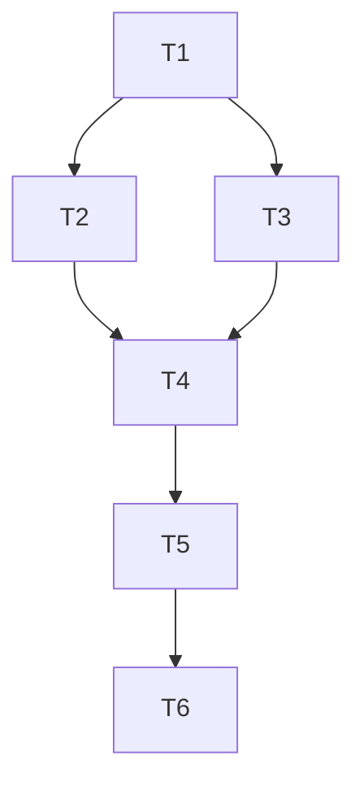

# Tasks: Button Design System Modernization & Minimalist Text-Only Buttons

## Test Coverage Matrix

| Requirement | Test Description | Test Target |
|---|---|---|
| BTN-01 | Button component renders with rounded-xl and tactile tokens | components/ui/button.tsx |
| BTN-02 | Signup page renders action button without decorative ArrowRight | app/[locale]/(auth)/signup/page.tsx |
| BTN-03 | Login page matches signup card geometry and renders text-only button | app/[locale]/(auth)/login/page.tsx |
| BTN-04 | Home page hero and CTA buttons render clean text without decorative icons | app/[locale]/page.tsx |
| BTN-05 | Mentors page filters and booking buttons render without decorative icons | app/[locale]/mentors/page.tsx |
| BTN-06 | TypeScript compilation and full unit test suite pass with zero errors | test suite |

## Gate Check Commands
- TypeScript typecheck: `npx tsc --noEmit`
- Unit tests: `npm test`
- Tasks validation: `python .agent/skills/tlc-spec-driven/scripts/validate_tasks.py button-design-system-modernization`

## Execution Plan

## Task Breakdown

### Phase 1: Core Design System Token Elevation

#### T1: Elevate Button Design Tokens in Button Component
**Where:** components/ui/button.tsx
**Depends on:** none
**Tests:** npx tsc --noEmit
**Gate:** npx tsc --noEmit

Update `buttonVariants` to set base `rounded-xl`, `active:scale-[0.98]`, default variant with `shadow-md shadow-primary/20 hover:shadow-lg hover:shadow-primary/25 hover:scale-[1.01]`, outline variant with `border-2 border-border bg-background hover:bg-muted/60`, and standard heights `default: h-11 px-5`, `lg: h-12 px-8 text-base font-bold`, `sm: h-9 px-3.5`.

### Phase 2: Page-Level Button Alignment & Icon Removal

#### T2: Remove Decorative Icons from Signup Page Action Buttons
**Where:** app/[locale]/(auth)/signup/page.tsx
**Depends on:** T1
**Tests:** npx tsc --noEmit
**Gate:** npx tsc --noEmit

Remove `<ArrowRight>` from the submit button and from success screen navigation links, keeping `Loader2` for loading states and official Google/LinkedIn SVG logos.

#### T3: Modernize Login Page Card, Inputs, and Text-Only Action Button
**Where:** app/[locale]/(auth)/login/page.tsx
**Depends on:** T1
**Tests:** npx tsc --noEmit
**Gate:** npx tsc --noEmit

Refactor the login card to match signup with `rounded-[2.5rem] border-none shadow-2xl shadow-primary/5`, header badge icon container, `h-11 rounded-xl bg-muted/20 border-none` inputs, and `h-12 rounded-xl` text-only submit button.

#### T4: Audit and Strip Decorative Icons from Home Page Buttons
**Where:** app/[locale]/page.tsx
**Depends on:** T2, T3
**Tests:** npx tsc --noEmit
**Gate:** npx tsc --noEmit

Inspect hero buttons, "Como Funciona" link, Quiz CTA, and final community CTA, removing decorative inline icons and aligning variants with global design tokens.

#### T5: Strip Decorative Icons from Mentors Catalog and Action Buttons
**Where:** app/[locale]/mentors/page.tsx
**Depends on:** T4
**Tests:** npx tsc --noEmit
**Gate:** npx tsc --noEmit

Remove decorative chevrons and redundant icons from search/filter trigger buttons and card CTA actions, leaving clear, accessible text.

### Phase 3: Final Verification & Type Safety

#### T6: Comprehensive Gate Verification and Regressions Check
**Where:** package.json
**Depends on:** T5
**Tests:** npm test
**Gate:** npx tsc --noEmit && npm test

Execute full TypeScript validation across all pages and run the complete Jest test suite (73/73 tests) to guarantee zero regressions.
