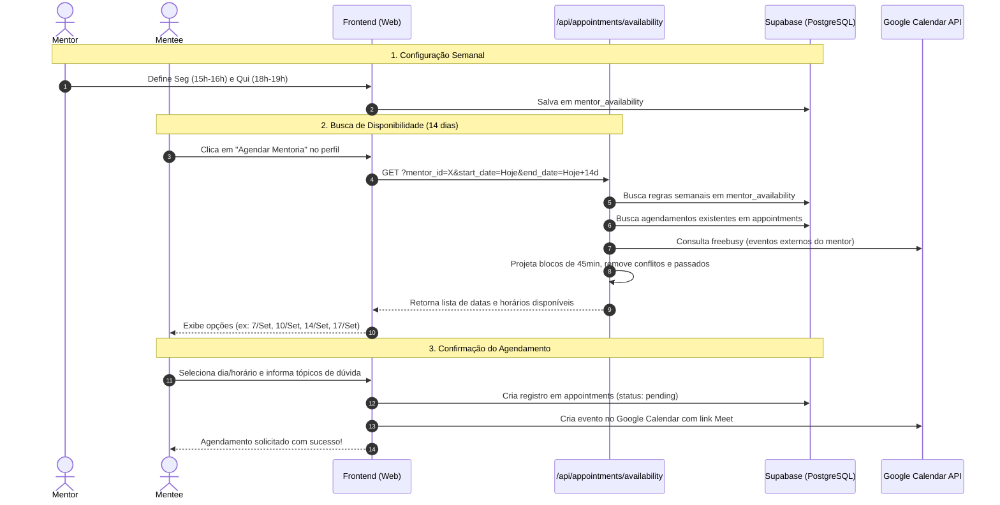

# Sistema de Agenda e Disponibilidade de Mentorias — Menvo

Este documento consolida as **regras de negócio, arquitetura e fluxo de dados** do sistema de agendamento e disponibilidade entre mentores e mentorados na Menvo.

---

## 🎯 Conceito Central: Template Semanal vs. Projeção no Calendário

O agendamento na Menvo opera sob dois conceitos fundamentais:

```
┌──────────────────────────────────────┐
│       TEMPLATE SEMANAL (Mentor)      │
│  "Atendo Segundas das 15h às 16h     │
│   e Quintas das 18h às 19h"          │
└──────────────────┬───────────────────┘
                   │ Projeção Dinâmica
                   ▼
┌──────────────────────────────────────┐
│     AGENDA DE 14 DIAS (Mentorado)    │
│  • Seg, 07/Set - 15:00 às 15:45      │
│  • Qui, 10/Set - 18:00 às 18:45      │
│  • Seg, 14/Set - 15:00 às 15:45      │
│  • Qui, 17/Set - 18:00 às 18:45      │
└──────────────────────────────────────┘
```

1. **Configuração Semanal do Mentor (`mentor_availability`)**:
   - O mentor **não** precisa cadastrar datas específicas todos os meses.
   - Ele configura um **padrão semanal recorrente** (ex: *Segunda-feira das 15:00 às 16:00*).
   - Isso garante previsibilidade e facilidade de manutenção para o mentor voluntário.

2. **Projeção Deslizante de 14 Dias (Visão do Mentorado)**:
   - Quando um mentorado acessa o perfil do mentor e clica em **"Agendar Mentoria"**, o sistema consulta a data atual e projeta todas as ocorrências daquele dia da semana nos **próximos 14 dias (2 semanas)**.
   - Por isso, uma regra de "Segunda-feira" se repete em 2 datas reais diferentes (a da semana atual e a da semana seguinte).

---

## 📋 Regras de Negócio Detalhadas

### 1. Duração Padrão das Mentorias
* **Duração Fixa:** Cada mentoria tem duração oficial de **45 minutos**.
* **Intervalo Mínimo:** Para que um horário fique disponível, a janela configurada pelo mentor deve ter **no mínimo 45 minutos**.
  - *Exemplo inválido:* 17:00 às 17:30 (30 min) ➔ **Não gera slots** e a tela do mentor exibe um aviso de validação impedindo o salvamento.
  - *Exemplo válido:* 17:00 às 17:45 (45 min) ➔ Gera 1 slot (17:00 - 17:45).
  - *Exemplo em bloco:* 15:00 às 17:00 (120 min) ➔ Gera 2 slots (15:00 - 15:45 e 16:00 - 16:45), deixando 15 minutos de respiro entre as sessões.

### 2. Bloqueios e Conflitos Dinâmicos
Um slot projetado só é exibido como disponível para o mentorado se passar por todos os filtros a seguir:

1. **Filtro de Passado:**
   - Horários cujo timestamp já tenha passado em relação ao horário atual são automaticamente descartados.
2. **Conflito com Sessões Menvo:**
   - Verifica na tabela `appointments` se já existe alguma mentoria com status `pending` ou `confirmed` que colida no intervalo de tempo.
3. **Conflito com Google Calendar:**
   - Se o mentor possui integração ativa com Google Calendar, a API faz uma chamada ao `calendar.freebusy.query`. Se houver qualquer evento pessoal/profissional no mesmo horário na agenda externa, o slot é bloqueado na Menvo dinamicamente.
4. **Ciclo Virtuoso de Feedback (Avaliações Pendentes):**
   - Se o mentorado tiver alguma mentoria passada que ainda não foi avaliada, o sistema bloqueia novos agendamentos e solicita a avaliação da sessão anterior.

### 3. Fuso Horário e Precisão
* Todo o banco de dados armazena os horários em **UTC**.
* As projeções utilizam o fuso horário de referência cadastrado no perfil do mentor (padrão: `America/Sao_Paulo` / GMT-3).
* Na API `/api/appointments/availability`, os horários são combinados com offset explícito de Brasília (`-03:00`) para conversão unificada em ISO strings.

---

## 🗄️ Estrutura de Dados no Supabase

### Tabela `mentor_availability`
Define a matriz semanal recorrente do mentor:

| Campo | Tipo | Descrição |
|---|---|---|
| `id` | `uuid` | Identificador único do slot |
| `mentor_id` | `uuid` | ID do perfil do mentor (`profiles.id`) |
| `day_of_week` | `smallint` | Dia da semana (0 = Domingo, 1 = Segunda, ..., 6 = Sábado) |
| `start_time` | `time` | Horário de início no formato `HH:MM:00` |
| `end_time` | `time` | Horário de término no formato `HH:MM:00` |
| `timezone` | `text` | Timezone de referência (ex: `America/Sao_Paulo`) |

### Tabela `appointments` (Sessões Agendadas)
Registra as mentorias efetivamente agendadas:

| Campo | Tipo | Descrição |
|---|---|---|
| `id` | `uuid` | Identificador único do agendamento |
| `mentor_id` | `uuid` | ID do mentor |
| `mentee_id` | `uuid` | ID do mentorado |
| `scheduled_at` | `timestamptz` | Data e hora de início em UTC |
| `duration_minutes` | `integer` | Duração em minutos (padrão: 45) |
| `status` | `text` | `pending`, `confirmed`, `completed`, `cancelled`, `rejected` |
| `google_meet_link` | `text` | Link gerado automaticamente via Google Calendar |

---

## 🔄 Fluxo Completo de Agendamento



---

## 🛡️ Tratamento de Erros e Casos de Borda

1. **Tentativa de salvar slot < 45 min:**
   - Validado no frontend antes do envio: *"O intervalo em {dia} deve ser de no mínimo 45 minutos (tempo de uma sessão)"*.
2. **Sobreposição de horários no mesmo dia:**
   - Validado no frontend antes do envio: *"Horários sobrepostos em {dia}"*.
3. **Mentor sem disponibilidade:**
   - Modal exibe mensagem explicativa de que o mentor não possui horários abertos e sugere retornar mais tarde.
4. **Mentee com avaliação pendente:**
   - O modal bloqueia a seleção de slots e exibe um botão direto para concluir a avaliação pendente da sessão anterior.
