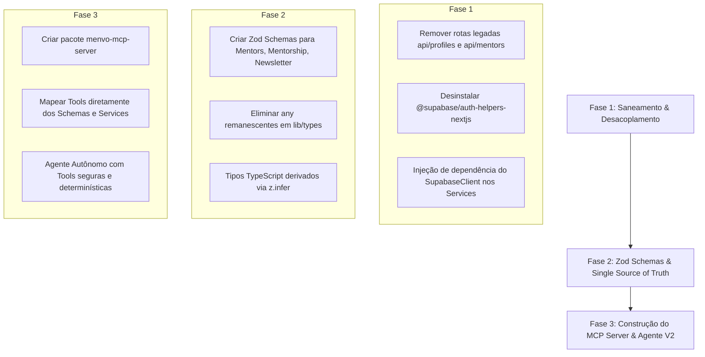

# 🗺️ Mapa Estratégico de Limpeza Arquitetural & Desacoplamento (Preparação V2)

Este documento sintetiza o diagnóstico gerado com base nas diretrizes do **`coupling-analysis`** (*Balancing Coupling in Software Design*, Vlad Khononov) e do **`frontend-blueprint`**, mapeando os pontos exatos de acoplamento a serem saneados para viabilizar um **Agente de IA** e um **MCP Server (Model Context Protocol)** robustos.

---

## 🎯 Por que o Agente e o MCP dependem dessa limpeza?

Um **MCP Server** expõe ferramentas (*tools*) com parâmetros estritamente validados (via **Zod**) para um modelo de linguagem (LLM). Quando o modelo decide invocar uma tool (ex: `find_mentors` ou `schedule_mentorship`), a função precisa:
1. Receber entradas tipadas e validadas por Zod.
2. Executar uma **função de serviço pura** (sem depender de `NextRequest`, `cookies()` ou contexto de browser `window`).
3. Devolver um resultado previsível e estruturado (DTO).

Se a lógica de negócio estiver misturada com rotas HTTP, hooks ou clientes de Supabase com instâncias hardcoded, o MCP Server falha ou exige duplicações massivas de código.

---

## 🔍 Diagnóstico de Acoplamento Atual

### 1. Inconsistência nos Clientes Supabase & Acoplamento a Cookies
Hoje existem 4 formas conflitantes de instanciar o Supabase no repositório:
- **`lib/utils/supabase/client.ts`**: Usa `createBrowserClient` do `@supabase/ssr` (apropriado para client components).
- **`lib/utils/supabase/server.ts`**: Usa `createServerClient` do `@supabase/ssr` lendo `cookies()` (apropriado para Server Components e Route Handlers).
- **`lib/services/auth/auth.service.ts`**: Instancia um `createClient` genérico de `@supabase/supabase-js`, que **não propaga cookies de sessão** para o Next.js.
- **Rotas Legadas**: 7 arquivos de API ainda importam `@supabase/auth-helpers-nextjs` (biblioteca obsoleta/descontinuada pelo Supabase).

### 2. Duplicação Funcional (Symmetric Coupling)
- `app/api/mentors/route.ts` vs `lib/services/mentors/mentors.service.ts`:
  - Ambos implementam a mesma lógica de filtro e paginação sobre a view `mentors_view`.
  - O endpoint `/api/mentors` nem sequer é consumido pelo frontend (o frontend chama `mentorService.getMentors()` diretamente).
- `app/api/profiles/` (plural) vs `app/api/profile/` (singular):
  - `app/api/profiles/route.ts` e `app/api/profiles/[id]/route.ts` são rotas mortas que usam o pacote legado `auth-helpers-nextjs`.

### 3. Falta de Schemas Zod de Entrada e Saída
Hoje apenas 4 domínios possuem schemas em `lib/schemas/`:
- `profile.ts`
- `quiz.ts`
- `appointment.ts`
- `feedback.ts`

Domínios como `mentors` (filtros e disponibilidade), `mentorship` (status de sessão, confirmação), `community`, `newsletter` e `waiting-list` ainda operam com interfaces TypeScript manuais e `any[]` (ex: `availability: any[]` em `lib/types/models/user.ts`).

---

## 📋 Plano de Ação em 3 Fases



### Fase 1: Saneamento Imediato & Desacoplamento
- [ ] **Eliminar rotas mortas**: Excluir com segurança `app/api/profiles/` e `app/api/mentors/route.ts`.
- [ ] **Migrar rotas residuais**: Atualizar as rotas de admin que ainda usam `auth-helpers` para usar `@/lib/utils/supabase/server`.
- [ ] **Desinstalar pacote obsoleto**: `npm uninstall @supabase/auth-helpers-nextjs`.
- [ ] **Injeção de Cliente nos Services**: Ajustar os serviços para receberem opcionalmente a instância do Supabase:
  ```typescript
  export class MentorService {
    constructor(private supabase: SupabaseClient = createDefaultClient()) {}
  }
  ```

### Fase 2: Schemas Zod & Tipagem Estrita (Single Source of Truth)
- [ ] **`lib/schemas/mentor.ts`**:
  - `mentorFiltersSchema`: Validação de busca, tags inclusivas, paginação.
  - `mentorAvailabilitySlotSchema`: Estruturação tipada de dia da semana, horários e timezone (eliminando o `any[]` em `user.ts`).
- [ ] **`lib/schemas/mentorship.ts`**:
  - `updateAppointmentStatusSchema`: Transições de status (confirmada, cancelada, reagendada).
- [ ] **`lib/schemas/newsletter.ts`**:
  - `newsletterSubscriptionSchema`: Validação de email, nome e consentimento LGPD.
- [ ] **Derivação de Tipos**: Substituir interfaces manuais por `z.infer<typeof schema>`.

### Fase 3: Construção do MCP Server & Agente Menvo (V2)
- [ ] Implementar MCP Server em `mcp/` ou pacote desacoplado:
  - **Tool `find_mentors`**: Input validado com `mentorFiltersSchema`, execução via `mentorService.getMentors()`.
  - **Tool `book_session`**: Input validado com `createAppointmentSchema`, execução via `mentorshipService.createAppointment()`.
  - **Tool `match_mentors_ai`**: Input validado com perfil de quiz/interesses, recomendação por IA.
- [ ] Agente Menvo integrado ao frontend via chat inteligente ou automações de suporte/mentoria.
